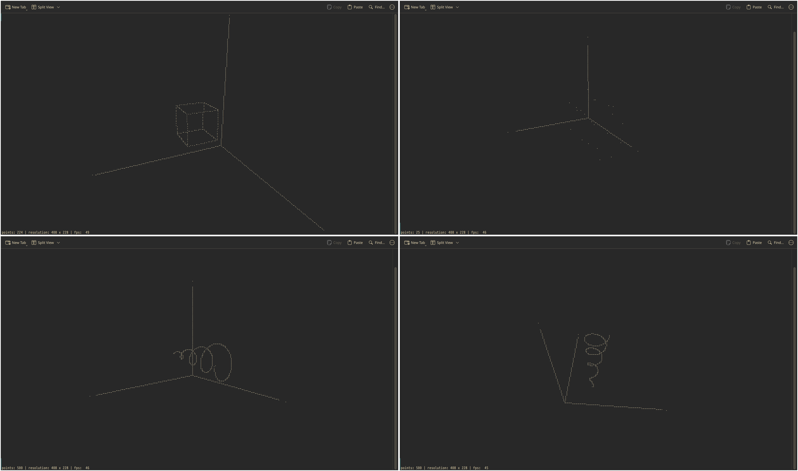

# altostratus

*Altostratus is a middle-altitude cloud genus made up of water droplets, ice crystals, or a mixture of the two.*

A 3d plotting library for Rust with one purpose, to render points in a cartesian system. We have pivoted entirely to making this terminal-first, and rendering to image capabilities have been dropped for the moment (since infinitely more mature libraries exist for rendering such systems as images, and the compatibility overhead while breaking the system for terminal rendering was getting too much).

## gallery

Here are some example outputs from altostratus:




## features

- display points in 3d space in the terminal
- interactive display with ability to zoom in/out, pan, rotate


## quick start

```bash
git clone https://github.com/AnarchistHoneybun/altostratus
cd altostratus

# Try the examples
cargo run -- datasets/cube.txt
cargo run -- datasets/points.txt
cargo run -- datasets/spiral.txt
```

## contributions

contributions are welcome, issues, and feature requests are encouraged. I'm writing this just to scratch the itch of not having to put images on my website, but have close to zero experience with rendering etc. so if you have an idea that improves this, open up an issue to make me aware of it. 